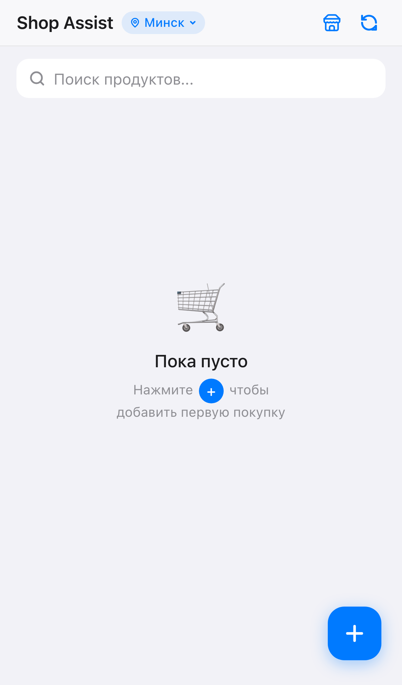
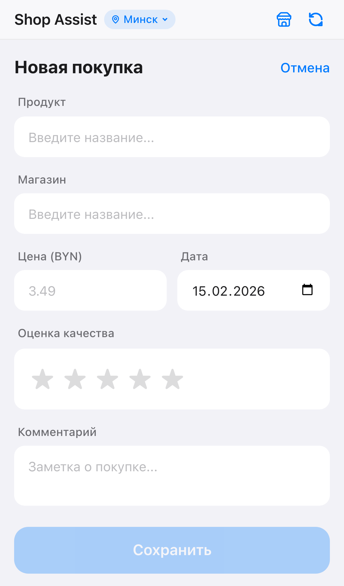
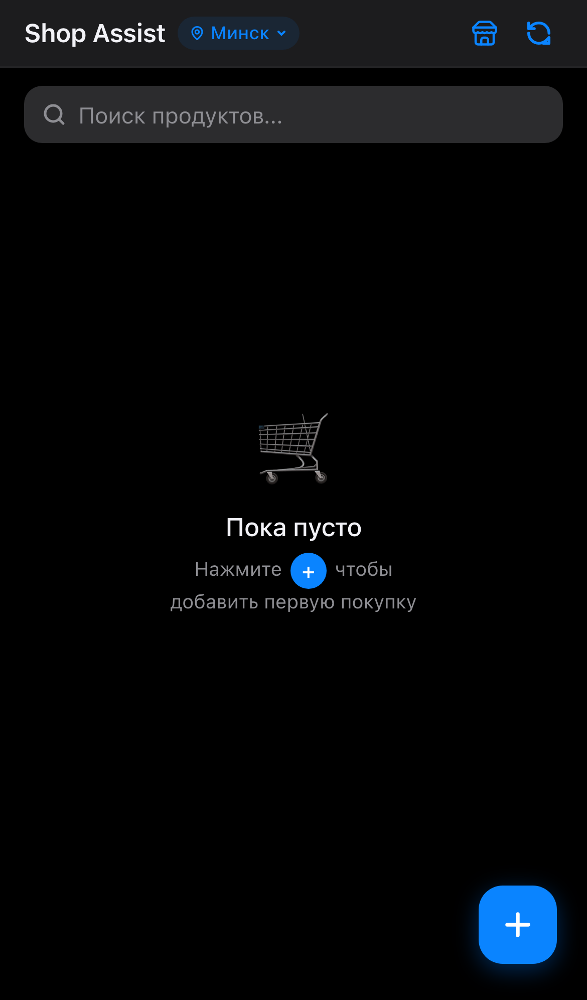

# Shop Assist — Price & Quality Tracker PWA

> Offline-first Progressive Web App for tracking product prices and quality across stores. Built for Telegram Mini Apps with full dark mode support.

<p align="center">
  
  &nbsp;&nbsp;
  
  &nbsp;&nbsp;
  
</p>

---

## Why Shop Assist?

Prices change. Quality varies. **Shop Assist** helps you remember *where* you bought something, *how much* it cost, and *whether it was worth it* — so you always know which store has the best deal.

- **Compare prices** across stores at a glance
- **Rate quality** with a 5-star system per purchase
- **Works offline** — all data stored locally on-device
- **Zero sign-up** — no backend, no accounts, just open and use
- **Telegram-native** — designed as a Telegram Bot Mini App with adaptive theming

---

## Features

| Feature | Description |
|---------|-------------|
| **Price Dashboard** | All products with best/last price per store, sortable and filterable |
| **Category Filter** | Dynamic category chips extracted from your data |
| **Smart Search** | Full-text search across product names and manufacturers |
| **Quick Add** | Create products and stores inline — no extra screens |
| **Store Locator** | Find stores by address using 4 geocoding APIs (OSM, Overpass, Photon, Geoapify) |
| **Quality Ratings** | 5-star rating per purchase with average calculation |
| **Inline Editing** | Edit any product or purchase data by tapping — no page navigation needed |
| **Category Autocomplete** | Select from existing categories or create new ones on the fly |
| **City Selector** | Pre-configured Belarusian cities for scoped store search |
| **Dark Mode** | Automatic theme from Telegram or system preference |
| **PWA** | Install to home screen, works offline, background updates |

---

## Tech Stack

| Layer | Technology |
|-------|-----------|
| **Framework** | React 19 + TypeScript 5.8 |
| **Build** | Vite 6 + SWC |
| **Database** | RxDB 16 (Dexie / IndexedDB) — reactive, offline-first |
| **Styling** | Tailwind CSS 4.1 with Telegram theme variables |
| **Routing** | React Router 7 (MemoryRouter for Mini App compatibility) |
| **PWA** | vite-plugin-pwa + Workbox (prompt update strategy) |
| **Telegram** | @telegram-apps/sdk-react 3 |
| **Geocoding** | Nominatim, Overpass QL, Photon, Geoapify |

---

## Architecture

```
src/
├── components/
│   ├── layout/           # AppShell, Header, UpdatePrompt
│   ├── dashboard/        # Dashboard, SearchBar, CategoryFilter, ProductTable, ProductRow
│   ├── purchase/         # AddPurchase, ProductSelect, StoreSelect, EditPurchase, EditProduct
│   └── shared/           # Input, Rating, FAB, ConfirmModal, CategorySelect
├── pages/                # DashboardPage, AddPurchasePage, ProductPage, StoresPage
├── db/
│   ├── database.ts       # RxDB initialization with Dexie storage
│   ├── hooks.ts          # useRxCollection, useRxQuery — reactive data bindings
│   ├── types.ts          # ProductDocument, StoreDocument, PurchaseDocument
│   └── schemas/          # RxJSON validation schemas
├── config/               # City context, app settings
├── hooks/                # useOsmSearch (multi-source geocoding), useCitySelect
├── telegram/             # SDK init, theme mapping, back button
├── pwa/                  # Service worker registration
└── styles/               # Tailwind theme with Telegram CSS variable mapping
```

### Data Flow

```
User Action → React Component → RxDB Collection → IndexedDB
                                      ↓
                               RxJS Observable
                                      ↓
                            React Re-render (reactive)
```

All data lives in **three collections**:

| Collection | Key Fields | Purpose |
|-----------|-----------|---------|
| `products` | name, manufacturer, packageVolume, category | Product catalog |
| `stores` | name, type (market/store), address | Store directory |
| `purchases` | productId, storeId, priceByn, qualityRating, purchaseDate | Purchase history |

### Theming

The app maps **Telegram Mini App theme variables** directly to Tailwind CSS custom properties. When running outside Telegram, it falls back to light/dark system preference with a matching color palette.

```
Telegram CSS vars → @theme CSS custom properties → Tailwind utility classes
```

---

## Getting Started

### Prerequisites

- Node.js 20+
- npm 9+

### Install & Run

```bash
git clone https://github.com/LastSkywalkerER/shop-assist.git
cd shop-assist
npm install
npm run dev
```

### Environment Variables

Create a `.env` file (optional — enables enhanced store search):

```env
VITE_GEOAPIFY_KEY=your_geoapify_api_key
```

Get a free key at [geoapify.com](https://www.geoapify.com/).

### Build for Production

```bash
npm run build
npm run preview
```

### Available Scripts

| Script | Description |
|--------|-------------|
| `npm run dev` | Start Vite dev server with HMR |
| `npm run build` | TypeScript check + production build |
| `npm run lint` | Run ESLint |
| `npm run preview` | Preview production build locally |

---

## Deployment

The build output (`dist/`) is a static site. Deploy to any static hosting:

- **Vercel** / **Netlify** — zero-config
- **GitHub Pages** — via `gh-pages` branch
- **Telegram Mini App** — host the static build and link via BotFather

### Telegram Mini App Setup

1. Build the project: `npm run build`
2. Deploy `dist/` to a public HTTPS URL
3. Open [@BotFather](https://t.me/BotFather) on Telegram
4. Use `/newapp` to register your Mini App with the deployed URL

---

## License

MIT
